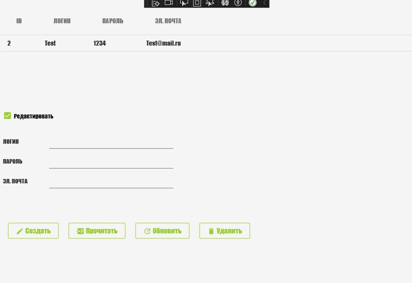

<h1>Задание 5.Использование EntityFrameworkCore и SQLite</h1>

Проект представляет собой простое WPF-приложение для входа в систему и возможностью редактировать данные пользователей и с использованием Entity Framework Core и SQLite

Для запуска необходимо открыть "Task5SQLite.exe"

